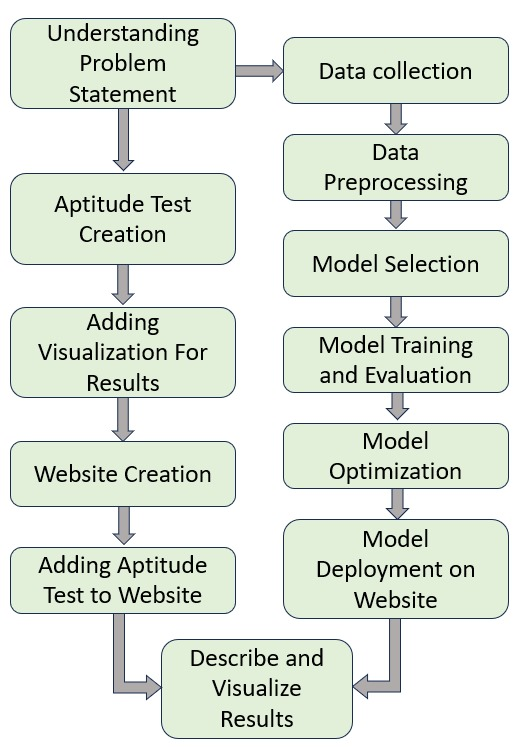
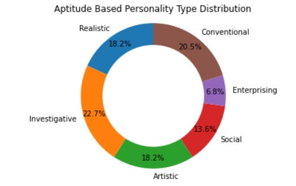
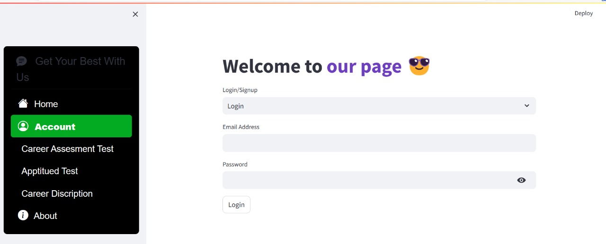

# Career-Recommendation-System-using-ML
The Career Recommendation System using Machine Learning ML project aims to revolutionize the way individuals make critical career decisions project is an innovative use of AI in the field of career counseling.
# Project Name: [Career Recommendation System using Machine Learning]
# PS Code : [SIH1434] 

## Team Name: Sinister Six!
- Team Members:Avani Brahmbhatt, Himadri Raval, Mit Thaker, Nandni Barot, Zurin Lakdavala, Priyanshi Limbachiya

- Contact Email:Hackathon600@gmail.com

## Project Overview :
The Career Recommendation System using Machine Learning AI project aims to revolutionize the way individuals make critical career decisions.The project is an innovative use of AI in the field of career counseling. Its ability to continuously develop and evolve ultimately provides it the forefront. The system's recommendations get more accurate and refined as AI technologies advance and more and more information becomes available. In a world where industries and employment needs are always changing, this constant evolution guarantees that people are prepared for current and relevant career advice.

**Purpose** The Career Recommendation System project's main goal is to use cutting-edge machine learning technology to offer highly customized career advise to individuals. The system seeks to match users with the best appropriate job routes by looking at their talents, education, hobbies, and industry trends. By lowering confusion and boosting confidence in one's career decisions, this project aims to simplify the difficult process of choosing a career path.

**Goal**The main objective of the project is to improve people's professional results. In order to increase their job happiness and long-term success, this entails assisting them in identifying career choices that reflect their skills and passions. Specific goals is to developing precise prediction models, regularly updating recommendations to reflect shifting employment dynamics, and ensuring the system's accessibility and user-friendliness for a wide range of users 

**Problem it solves**:In today's complex world, people frequently have to navigate a wide range of employment possibilities, each with its own set of criteria and opportunities. The scope and usefulness of traditional career advice systems might be limiting. They might not take consideration an individual's particular abilities, preferences, and dynamic nature of the industry. By offering personalized career guidance that is based on an extensive knowledge of an individual's talents, interests, and the current employment market, this project aims to address these problems.

**Significance**:The importance of this research depends on its capacity to empower individuals with personalized and data-driven insights so they may make wise career decisions. It will assist people in matching their skills and career goals with the best career paths, ultimately resulting in higher job satisfaction, increased productivity, and success in their careers.This Career Recommendation System aims to revolutionize how people begin their professional paths by utilizing machine learning and artificial intelligence, making the exploration of meaningful and satisfying occupations more accessible and attainable for everyone.

## Tech Stack :

Here are the technologies and tools we used to build our AI solution:

example :

* **Python**
* **Streamlit** 

## Project Features and Functionality 

**User Profile Creation:**
Users begin by creating their profiles, inputting information such as their skills, personal interests. The system may also offer options for assessments or quizzes to gather more detailed data.

**Ml based Recommendation Engine:**
The heart of the system is its advanced recommendation engine, driven by machine learning algorithms. This engine analyzes the user's profile data and combines it with real-time job market information to generate highly personalized career recommendations.

**Personality based Apptitude Test:**
The test can help the user for better undertsanting of their skills and choices according their personality.

**Career Path Visualization:** 
Users can explore and visualize recommended career paths, including potential job titles, required skills. This feature offers a clear and intuitive way for users to understand their options.

**User Interaction:**
Users will primarily interact with the Career Recommendation System through a user-friendly web or mobile interface. They will create their profiles, receive recommendations, explore career paths, and track their progress, all within this interface.

**Benefits for Users:**
Personalized Guidance: Users gain access to tailored career recommendations that align with their unique skills and interests, reducing the guesswork in career decision-making.
Efficient Skill Development: The system helps users identify skill gaps and provides efficient pathways to acquire the skills needed for their chosen career paths, potentially saving them time and money.
Increased Confidence: By offering data-driven recommendations and progress tracking, the system empowers users to make confident career decisions and take actionable steps toward their goals.

## How It Works :
**User Profiles:** Users create profiles by providing information about their education, skills, and personal interests. This data serves as the foundation for personalized recommendations.

**Recommendation Engine:** The ML based recommendation engine is the core component of the system. It consists of several machine learning models and data processing modules.

**Description about diffrent streams:** The system provides basic information new streams,including vocational courses and main feilds.

**Detailed Description of courses:** A person can find all the available graduation deggrees according to their preference in webpage.

## Challenges and Solutions :

**1)Data Quality and Quantity:**
Challenge: Obtaining high-quality and diverse data on job market trends and user profiles was a significant challenge. Data availability and consistency varied across different regions and industries.
Solution: We implemented data preprocessing techniques to clean and standardize incoming data. Additionally, we actively collaborated with data providers and job search platforms to improve data quality.

**2)Personalization and Accuracy:**
Challenge: Ensuring that the AI-driven recommendations were highly personalized and accurate for individual users was a complex task, especially when dealing with users from diverse backgrounds and career stages.
Solution: We employed advanced machine learning algorithms, including collaborative filtering and content-based filtering, to improve recommendation accuracy.

## Future Enhancements :
**Skill Gap Analysis:** The system identifies gaps in a user's skills compared to the requirements of their recommended career paths. It offers customized learning resources, such as online courses or certifications, to help users bridge these gaps

**Personalized Learning Plans:** For users looking to upskill or transition into a new field, the system generates personalized learning plans. These plans outline a step-by-step path to acquiring the necessary skills and qualifications.

**Access learning resources:** The system will help the user to find out relevent learning resource according to their skills and intrest.

**Real-Time Insights:** Users benefit from up-to-date job market insights, ensuring that their career choices remain relevant in a rapidly changing employment landscape.

## Screenshots and Demos:

**Project Workflow:** 
![Alt text]

**Aptitude Visualization Demo:** 
![Alt text]

**Website:**
![Alt text]

## Acknowledgments: 
Special Thanks to our HOD Dr. Ravi Gor for giving us this opportunity. Also thanks to our mentors Saurabh Das and Naqibahmed Kadri for helping us to solve doubts and conflits through the project.

## Get In Touch:

| Team Member | LinkedIn | Kaggle | Email |
|---|---|---|---|
| Avani Brahmbhatt |  | [Hackathon600@gmail.com
](mailto:Hackathon600@gmail.com) |

